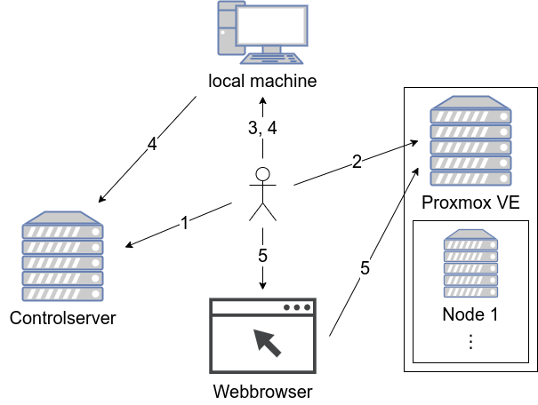
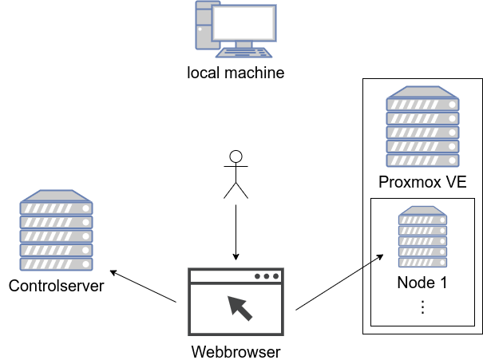
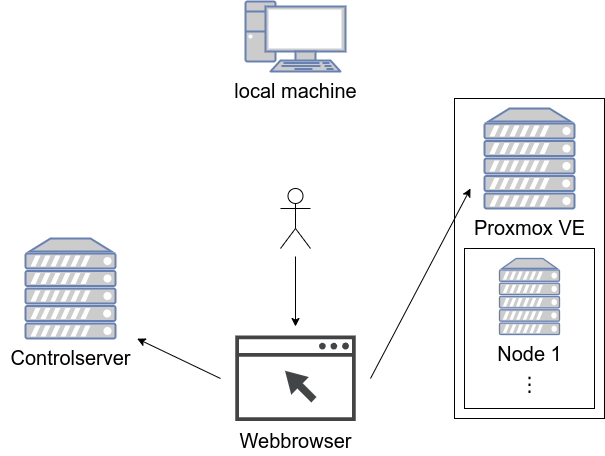

# How does it work?

## Install
This section describes how to install the controlserver and the Proxmox VE server.
The controlserver provides the clustarr webinterface which can be used to maintain the cluster.
The Proxmox VE server is used to serve the cluster nodes as virtual machines.
The controlserver and Proxmox VE server have to be in the same network subnet.

1. The user installs Ubuntu Server on a host that is called controlserver following
[this guide](setup-controlserver.md#installation).

2. The user installs Proxmox VE on a host following [this guide](setup-proxmox.md).

3. The user installs ansible on its local machine and clones the [ansible](https://github.com/clustarr/ansible)
repository where the ansible playbooks are located. [This guide](setup-local-machine.md) describes how to proceed.
Some of the default settings must be adjusted before proceeding, more info [here](ansible-configuration.md).

4. The user [executes the ansible playbook](setup-controlserver.md#execute-the-ansible-playbook) to setup the
controlserver. The ansible playbook connects via SSH to the controlserver and configures it.

5. The user opens the webinterface in his webbrowser and [starts the task](webinterface.md#setup-proxmox-ve) that
configures the new Proxmox VE host.

## Add host
This section describes to add a new host. This host is not added to the kubernetes cluster automatically.

The user [adds a new host](webinterface.md#add-host) inside the webinterface. An ansible playbook is executed by the
backend. This playbook creates a new Proxmox VM, modifies the Preboot Execution Environment (PXE) config on the
controlserver and starts the VM. The PXE config allows the VM to automatically install Ubuntu Server after boot.

## Add host to cluster
This section describes to add a previously created host to the kubernetes cluster.

The user decides to add a previously added host to the cluster. He uses
[the corresponding button](webinterface.md#add-host-to-cluster) in the webinterface and selects if this host should be a
master or worker node. An ansible playbook is executed, installs the dependencies on the selected host, generates
an updated Rancher Kubernetes Engine (RKE) config on the controlserver and use RKE to apply cluster changes.

## Delete host
This section describes to delete a previously created host or cluster node. 

The user decides to [delete a host](webinterface.md#delete-host) using the webinterface. The corresponding playbook
stops and removes the selected Proxmox VM. If the host is a cluster node it generates an updated RKE config on the
controlserver and uses RKE to apply cluster changes.
