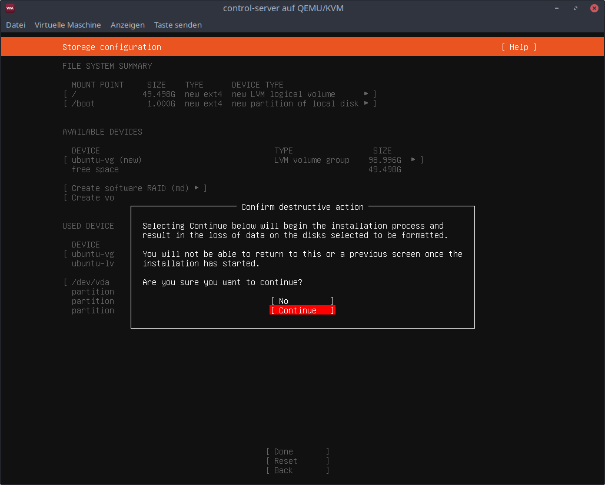

# Setup Controlserver

## Installation
Download `Ubuntu Server 20.04 LTS` from [here](https://ubuntu.com/download/server) and start the installation.

### Choose Language


Select `English`.

### Keyboard configuration


Choose `Layout: German` and select `Done`.

### Network connections


Leave the default settings and select `Done`.

### Configure proxy


Leave the default settings and select `Done`.

### Configure Ubuntu archive mirror


Leave the default settings and select `Done`.

### Guided storage configuration


Leave the default settings and select `Done`.

### Storage configuration


Leave the default settings and select `Done`.



Select `Continue`.

### Profile setup


Choose the settings

- name: `Ansible`

- servername: `controlserver`

- username: `ansible`

- password: `123456`

and select `Done`.

### SSH Setup


Check `Install OpenSSH server` and select `Done`.

### Featured Server Snaps


Leave the default settings and select `Done`.

### Reboot


Wait for the installation complete message and select `Reboot`.

## Execute the ansible playbook
Now you can start the ansible playbook to configure the controlserver.

Make sure you have adjusted the controlserver IP address first. More info [here](ansible-configuration.md#controlserver).

Then run the command
```shell
ansible-playbook setup-controlserver.yml -k -K
```
and enter your password.
