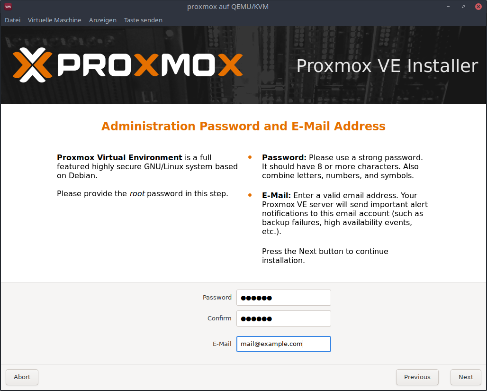

# Setup Proxmox VE

## Installation
Download the Proxmox VE ISO image file from [here](https://www.proxmox.com/de/downloads/category/iso-images-pve) and start the installation.

### Boot

Select `Install Proxmox VE`.

### EULA

Accept the end user license agreement.

### Target harddisk

Select the target harddisk.

### Location and Timezone

Choose the country, timezone and keyboard layout.

### Password and E-Mail Address

Choose a password, confirm it and choose an email address.

The default password in the ansible configuration is `123456`.
If you choose a different password here, you have to adjust it in the
[ansible configuration](ansible-configuration.md#host-and-password) too.

### Network configuration

Specify the network configuration.
Make sure that the Proxmox VE host is in the same network as the controlserver.

This IP address must be adjusted in the ansible configuration later.
More info [here](ansible-configuration.md#proxmox).

### Summary

Confirm the summary to start the installation.

### Reboot

Remember the ip address and port. Reboot the system.

## Access the webinterface (optional)

Connect to the shown address (here `https://192.168.40.190:8006/`) and accept the self signed certificate.

Login using user `root` and the password specified before.
