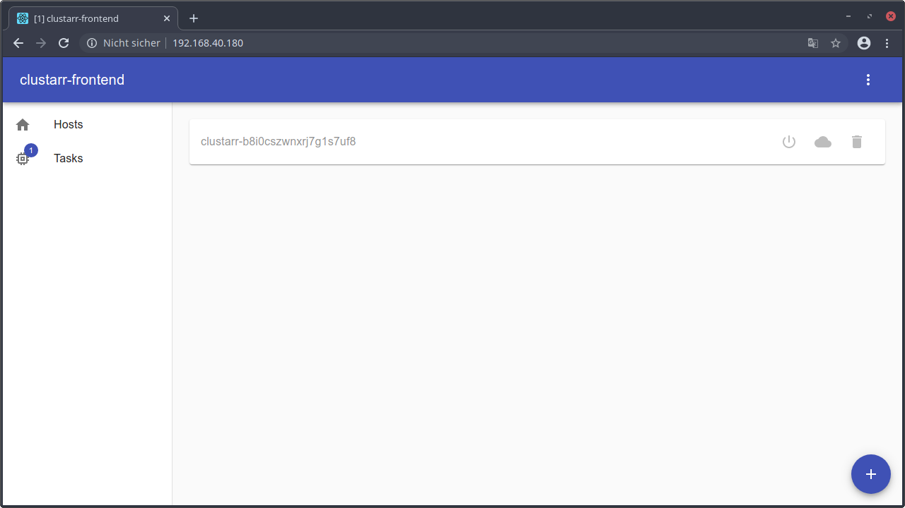

# Webinterface

## Overview
The webinterface is available at the url `http://<control-server-ip>/` after the controlserver is installed.

It allows to automatically configure the Proxmox VE server, add Hosts, add Hosts to the kubernetes cluster and delete
hosts again.

## Setup Proxmox VE
The Proxmox VE instance must be configured once after the Proxmox VE installation.

To run that configuration task, click on the `⋮` button in the menu bar and select `Setup Proxmox`.

## RKE up

Within the `⋮` menu there is also an option `RKE up`. Normally this option is not required. But sometimes the 
automatically executed RKE up command by the ansible playbooks is failing. In this case the RKE up command can be
triggered manually using this button.

## RKE remove

Within the `⋮` menu there is also an option `RKE remove`. Normally this option is not required and should be executed 
with caution since this task shuts down and removes the entire cluster!

## Tasks

### Tasks overview

Tasks that are currently being executed or were executed in the past are collected in the Tasks view that is reachable
by the `Tasks` button inside the drawer on the left side.

The recently executed `Setup Proxmox` task is currently running which is displayed by the circular progress indicator.

Once the task is completed or failed, the circular progress indicator disappears and is replaced by an corresponding
icon.

### Task output

The entire task output is displayed within a popup dialog that is opened on a click of the task element.

### Cancel Task

Running tasks can be canceled by clicking the cancel button of the task element.

## Hosts

### Hosts overview

Available hosts are collected in the Hosts view that is reachable by the `Hosts` button inside the drawer on the left
side.

### Add host

New hosts can be added using the floating plus button in the bottom right corner. These hosts are not automatically
added to the kubernetes cluster so they can also be used for other applications.

Within a popup dialog the hostname can be specified. A default random hostname is generated by default.

After the popup dialog confirmation, the ansible playbook automatically adds a new Proxmox VM and installs Ubuntu Server
on that VM.

While the task is running there is a disabled host within the hosts overview.

After the task is succeeded the previously disabled host and its buttons are enabled.

### Add host to cluster

To add a host to the kubernetes cluster click on the cloud icon inside the host element within the hosts overview.

The opened popup dialog allows to change the behavior of the task.

The host type of the node in the cluster can be selected here. A kubernetes cluster have to contain at least one master
node that controls the worker nodes. The worker nodes executes the containers.

The second options allows to disable the automatically rke up execution within the task. If this option is disabled,
the [RKE up task](#rke-up) have to be executed manually afterwards to apply the changes.

### Delete host

To delete a host the trash symbol inside the host element can be used. If the host is already a node of the cluster, 
the node will be removed from the cluster too.

If you are sure to delete the host you have to agree the popup dialog. 
