# setup control node


## Prepare installation
Download `Ubuntu Server 20.04 LTS` from `https://ubuntu.com/download/server` and start the installation


## Choose Language
Select `English`

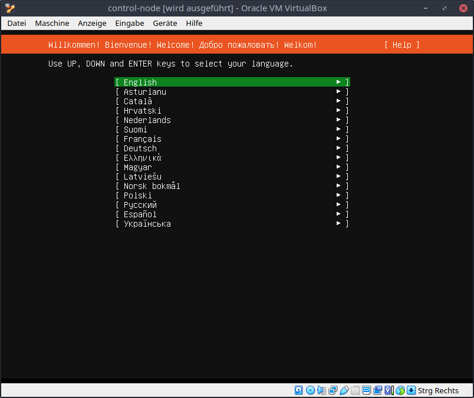


## Keyboard configuration
Choose `Layout: German` and select `Done`

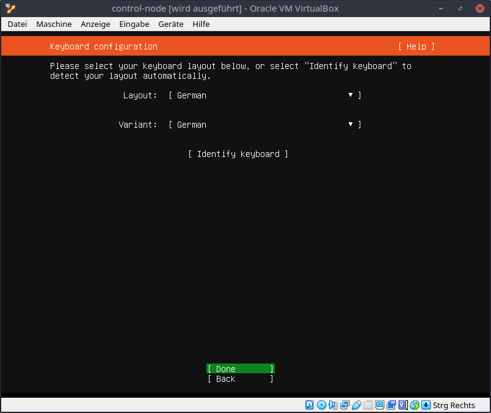


## Network connections
Select `Done`

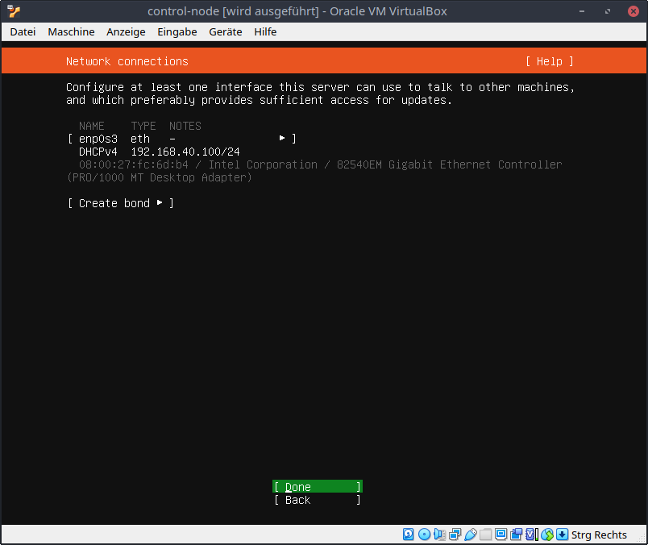


## Configure proxy
Select `Done`

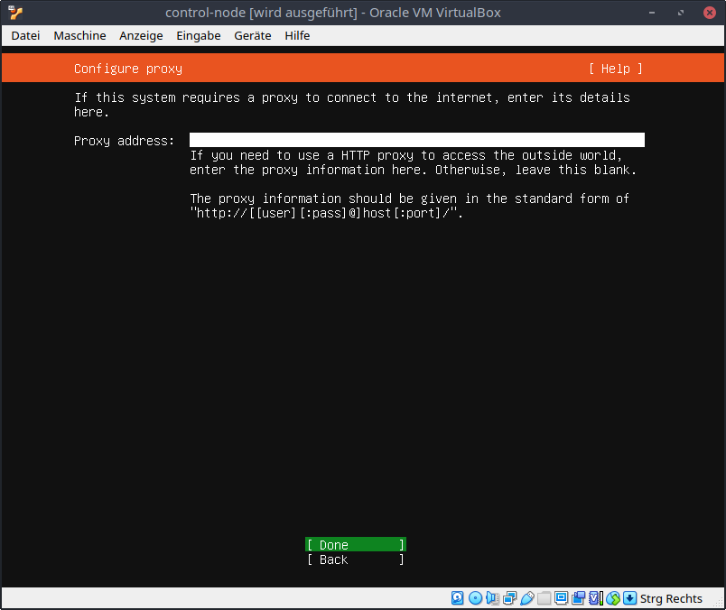


## Configure Ubuntu archive mirror
Select `Done`


## Guided storage configuration
Select `Done`

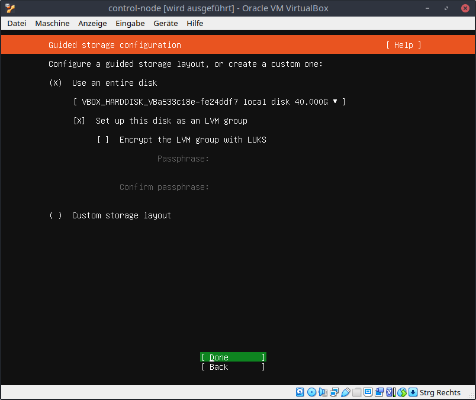


## Storage configuration
Select `Done`

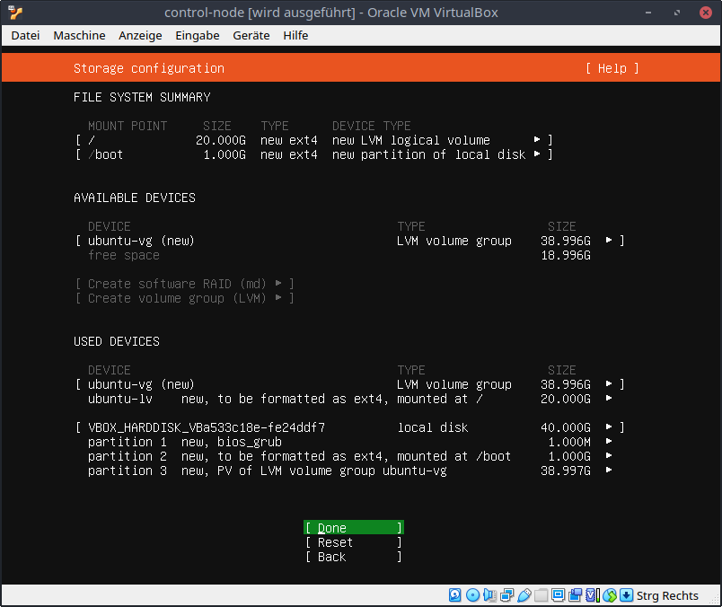

Select `Continue`

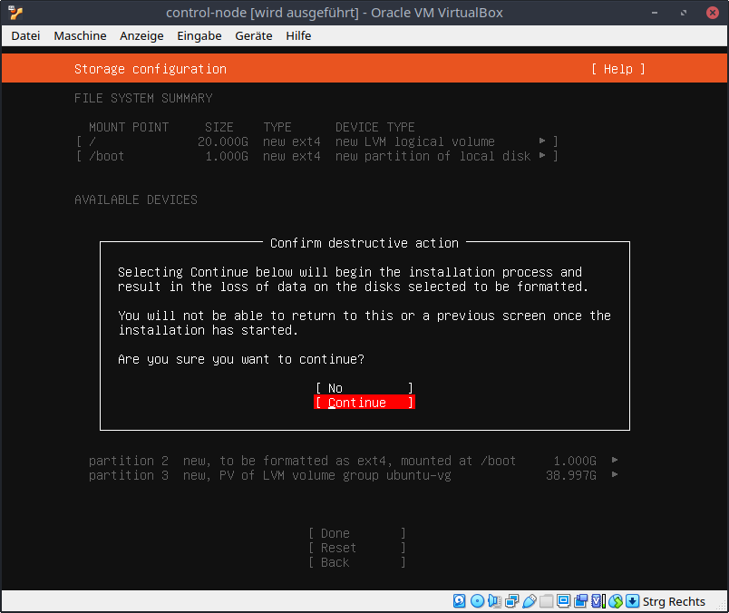


## Profile setup
Choose
```
name: Ansible
servername: controlnode
username: ansible
password: 123456
```

Select `Done`

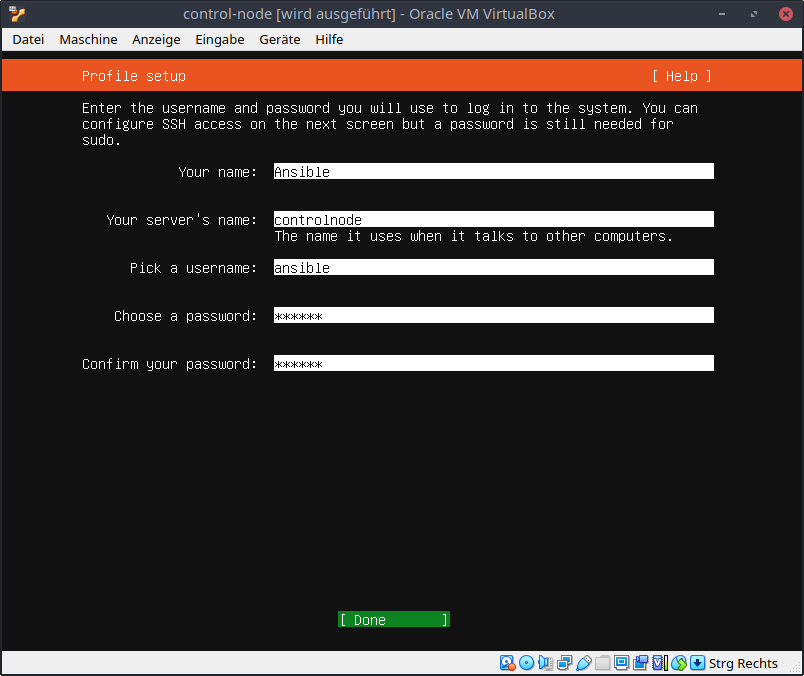


## SSH Setup
Check `Install OpenSSH server`

Select `Done`

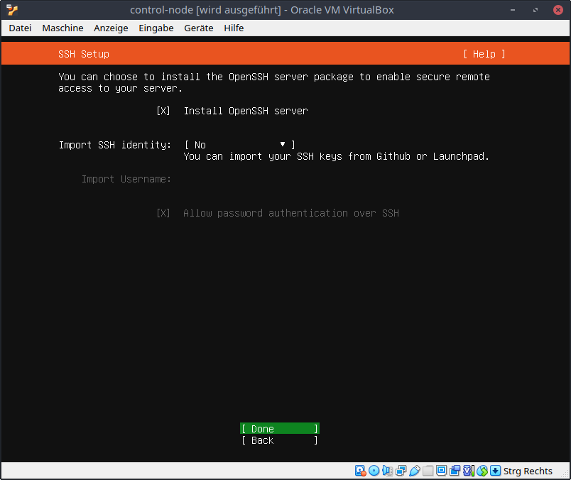


## Featured Server Snaps
Select `Done`

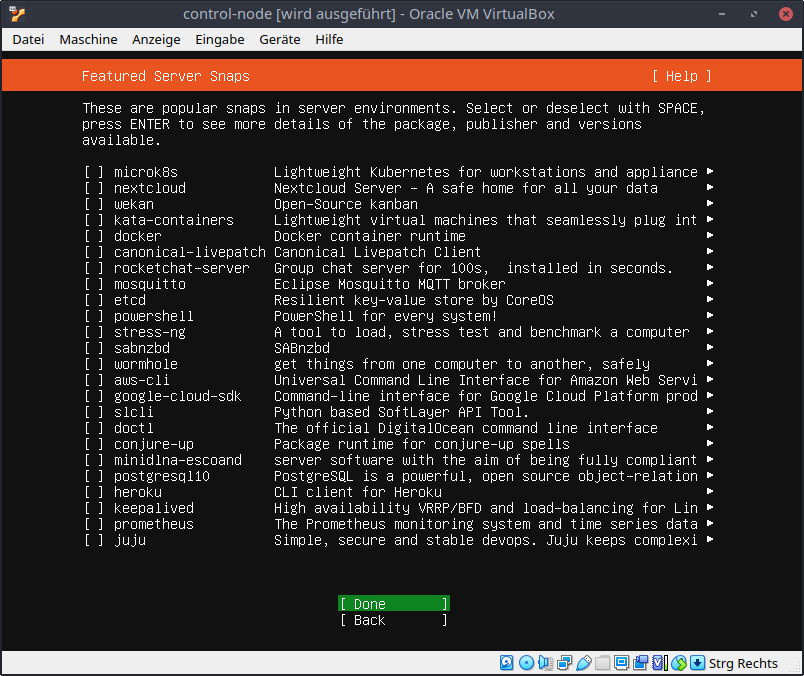


## Installation
Wait for installation complete message

Select `Reboot`

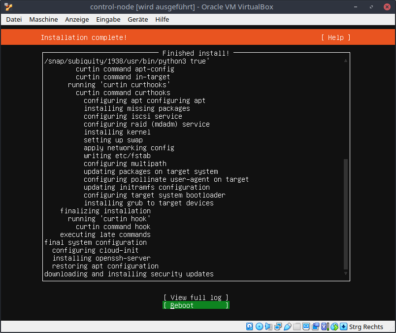


## Accept SSH fingerprint
SSh into control node `ssh ansible@192.168.40.100`

type `yes` to accept the fingerprint

type password `123456`

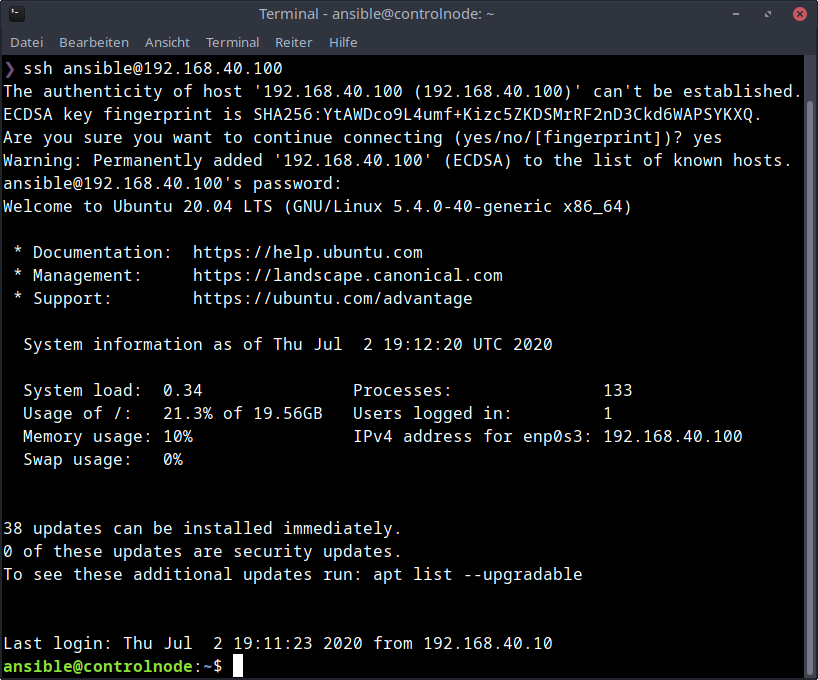


## Run ansible playbook
Now you can start the ansible playbook to configure the control node.

`ansible-playbook setup-controlserver.yml -u ansible -K`

type password `123456`

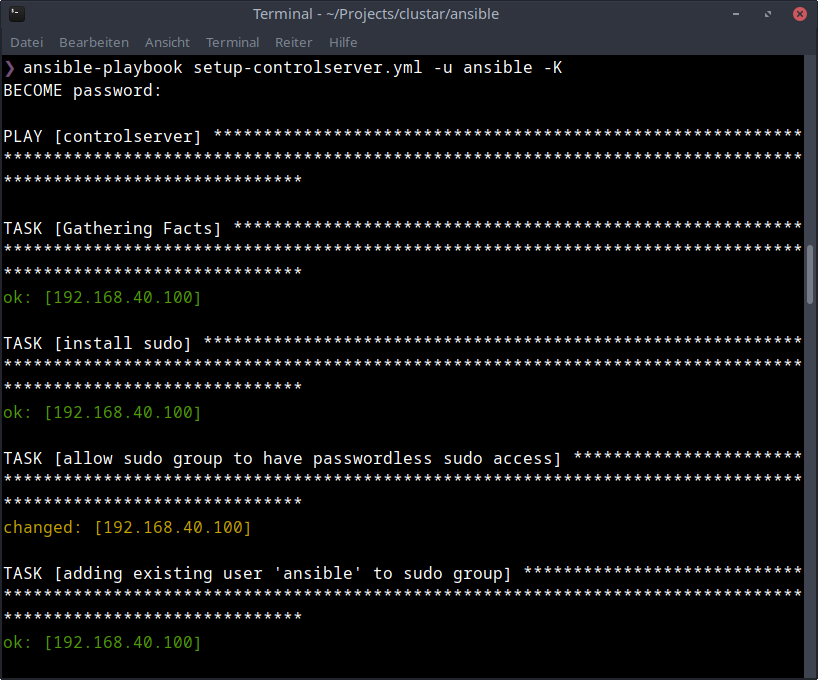
