# setup control node


## Prepare installation
Download `Ubuntu Server 20.04 LTS` from `https://ubuntu.com/download/server` and start the installation.


## Installation

### Choose Language
Select `English`

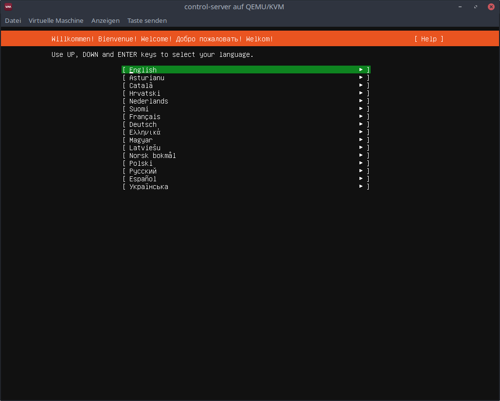


### Keyboard configuration
Choose `Layout: German` and select `Done`

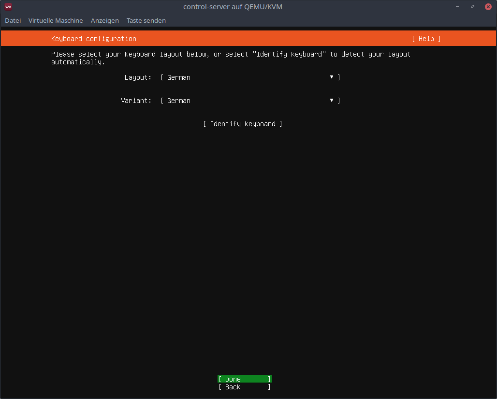


### Network connections
Select `Done`

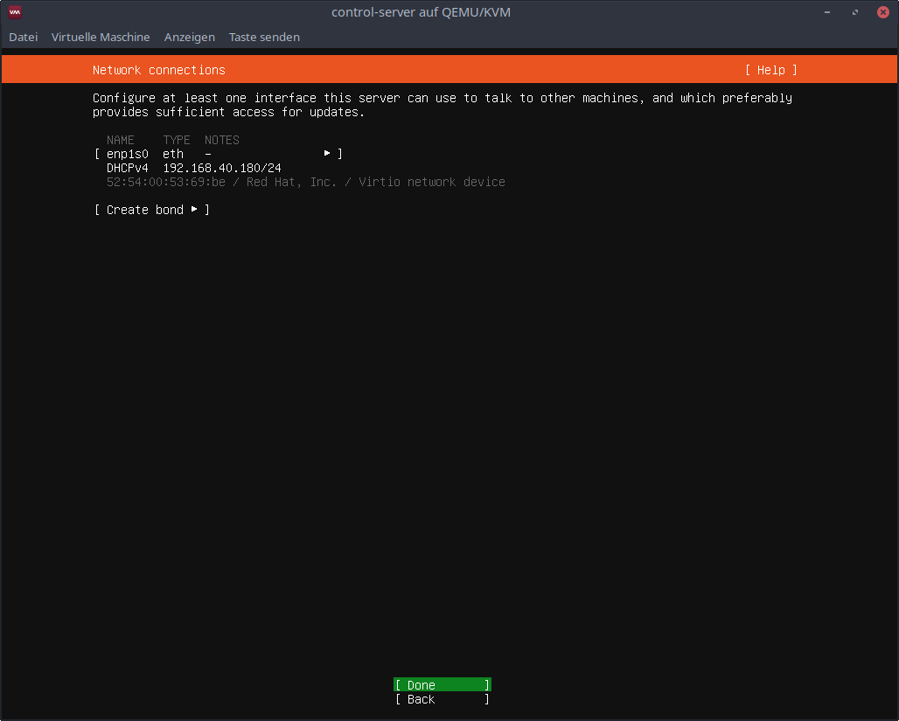


### Configure proxy
Select `Done`

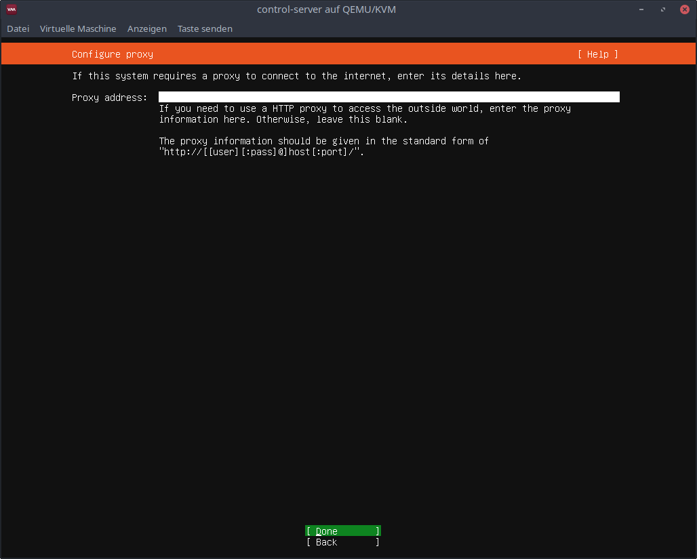


### Configure Ubuntu archive mirror
Select `Done`

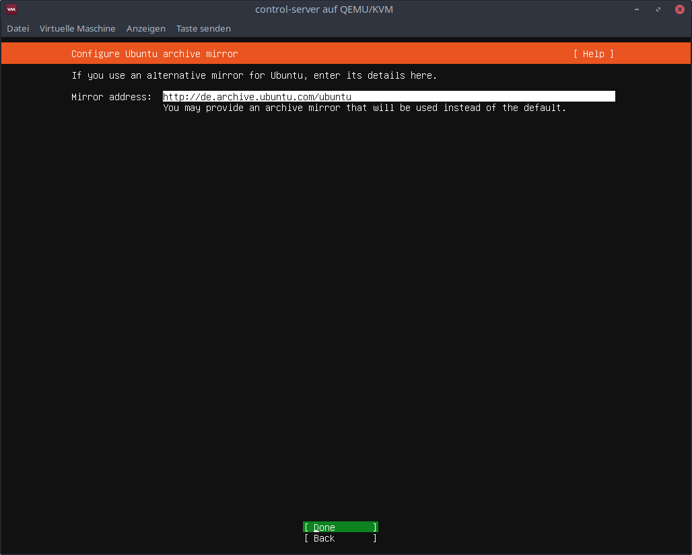


### Guided storage configuration
Select `Done`

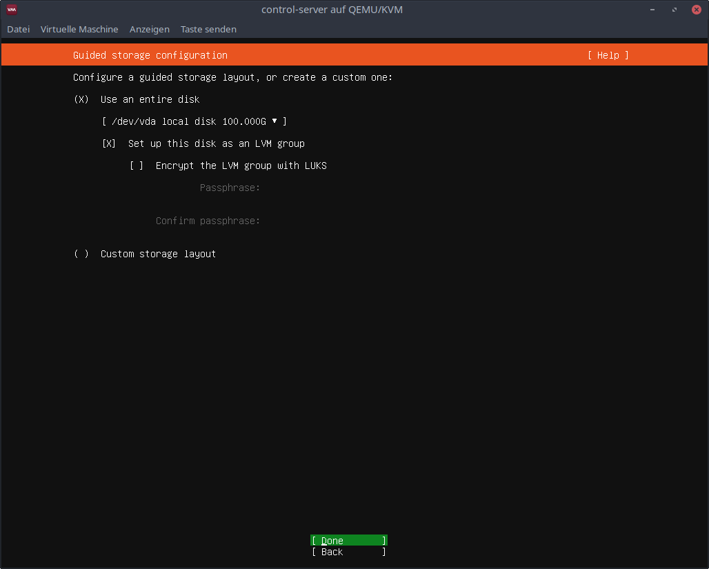


### Storage configuration
Select `Done`


Select `Continue`

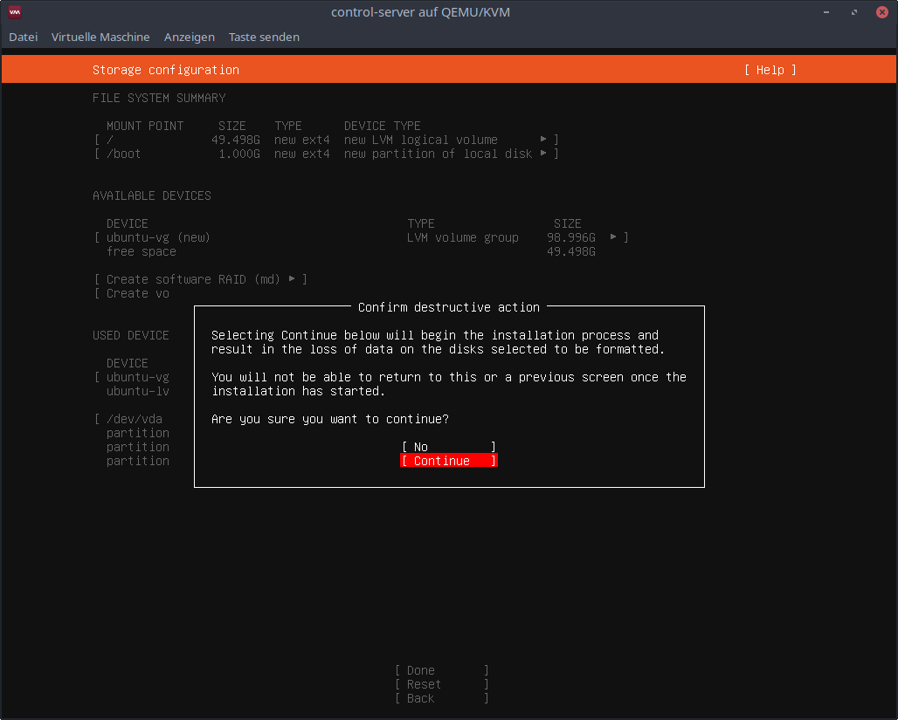


### Profile setup
Choose
```
name: Ansible
servername: controlserver
username: ansible
password: 123456
```

Select `Done`

<!---
TODO: fix servername in image 9.png
-->

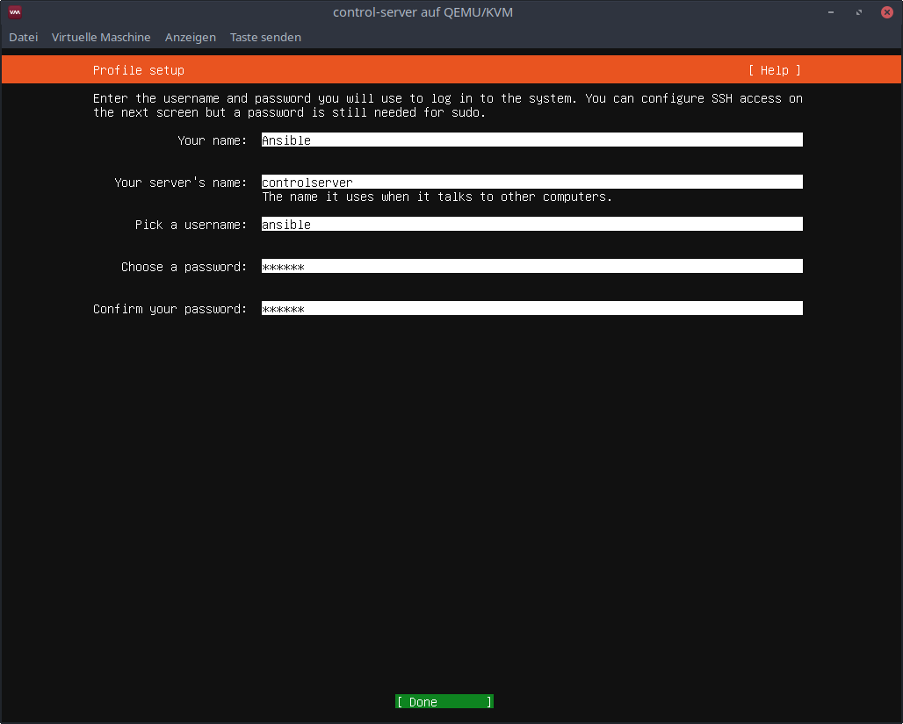


### SSH Setup
Check `Install OpenSSH server`

Select `Done`

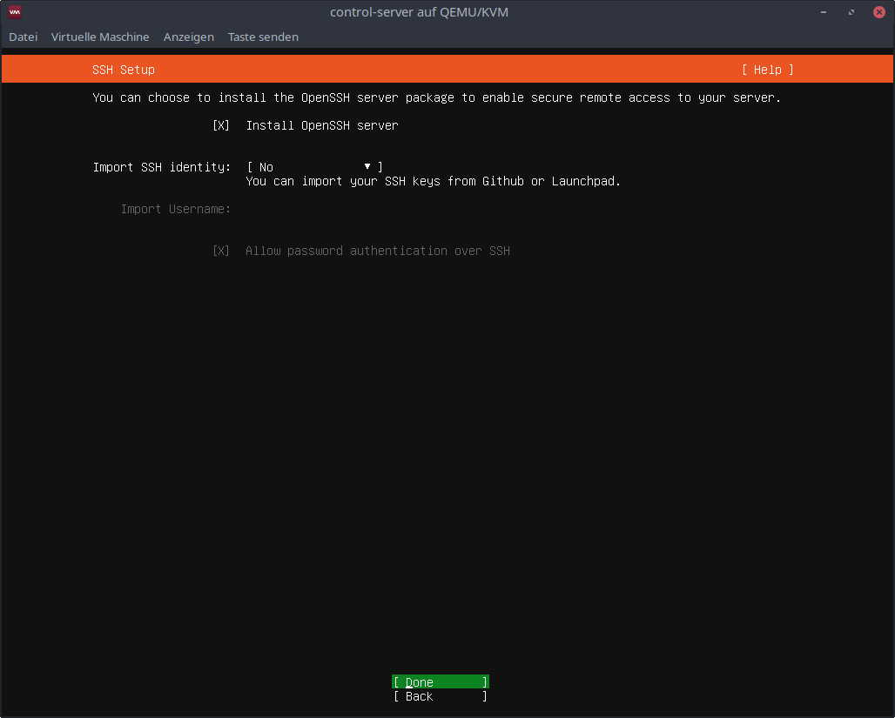


### Featured Server Snaps
Select `Done`

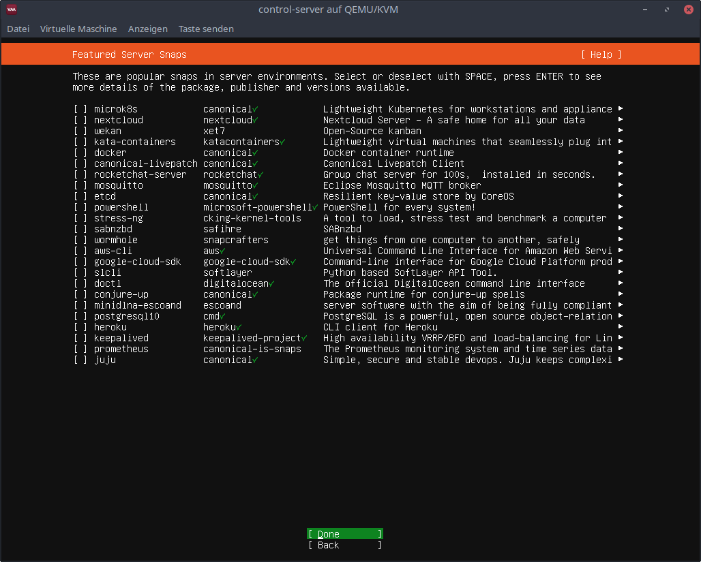


### Installation
Wait for installation complete message

Select `Reboot`

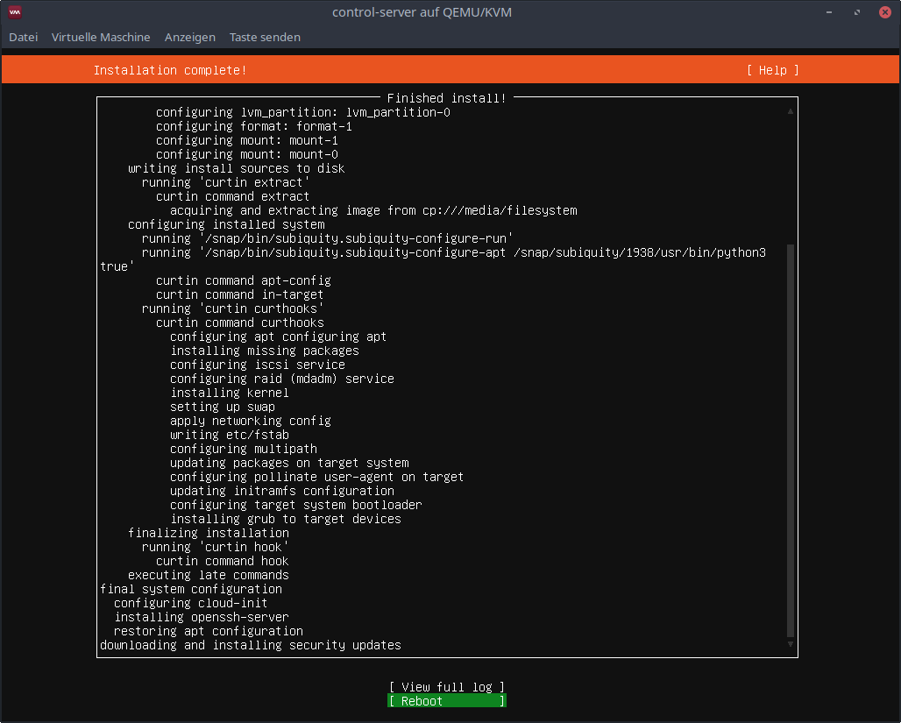


### Accept SSH fingerprint
SSH into control node `ssh ansible@192.168.40.180 exit`, enter your password and type `yes` to accept the fingerprint.

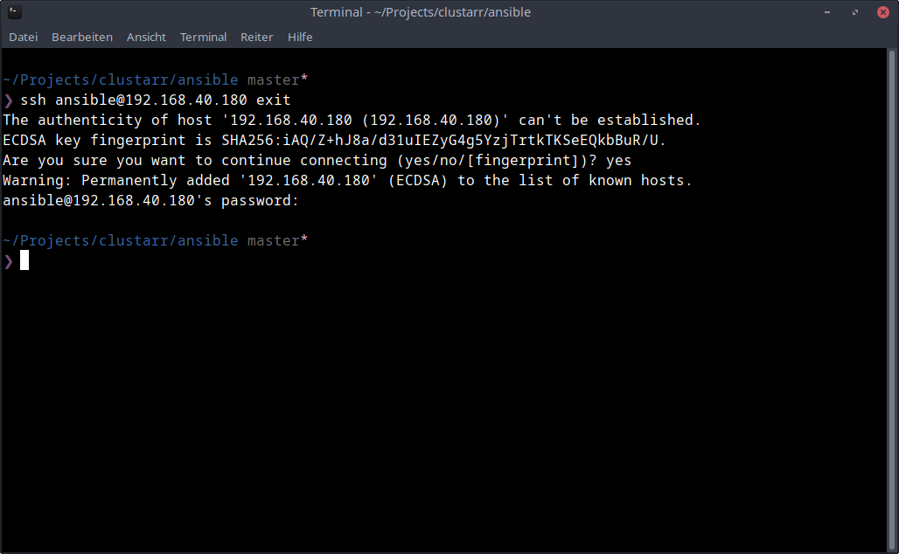


### Run ansible playbook
Now you can start the ansible playbook to configure the control node.

`ansible-playbook setup-controlserver.yml -u ansible -k -K`

Enter your password.

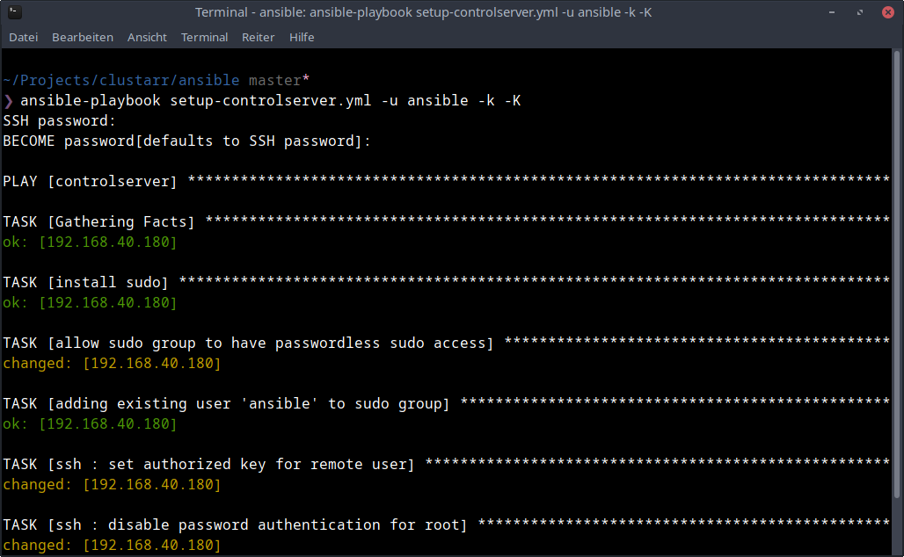
