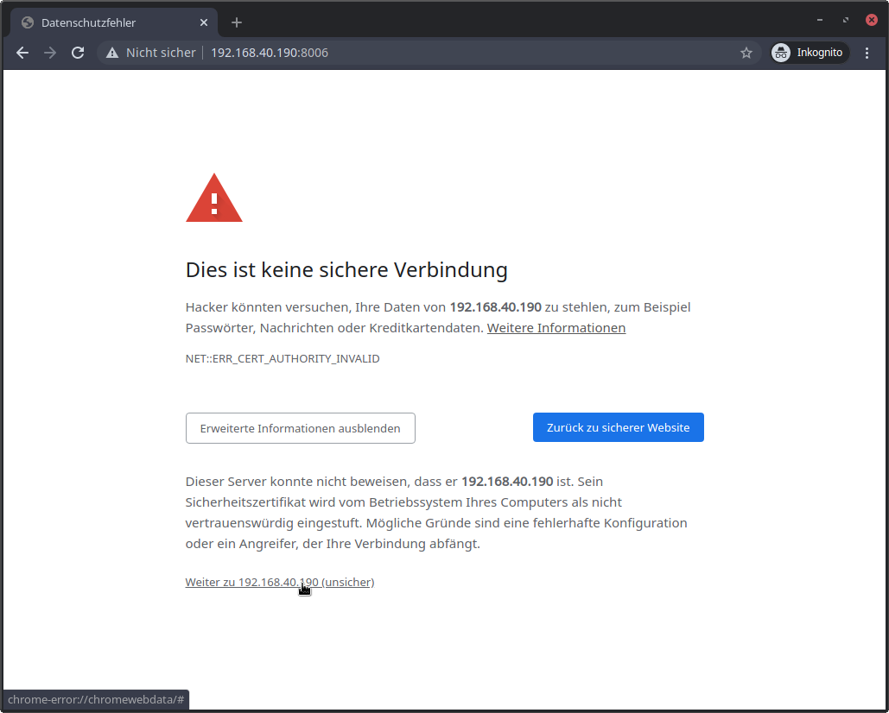
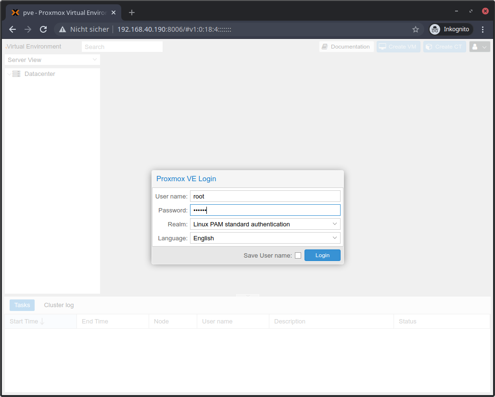

Download Proxmox VE iso

`https://www.proxmox.com/de/downloads/category/iso-images-pve`

Boot from the iso to start the installation.

Select `Install Proxmox VE`

Accept the end user license agreement.

Select the target harddisk.

Choose the country, timezone and keyboard layout.

Choose a password, confirm it and choose an email address.

Specify the network configuration.

Confirm the summary to start the installation.

Remember the ip address and port. Reboot the system.

Connect to the shown address `https://192.168.40.192:8006/` and accept the self signed certificate.

Login using user `root` and the password specified before.

## Notes for virtualbox
Follow this steps:

`https://pve.proxmox.com/wiki/Proxmox_VE_inside_VirtualBox`.

Enable nested virtualization on vm named `proxmox` using the command

`VBoxManage modifyvm proxmox --nested-hw-virt on`
